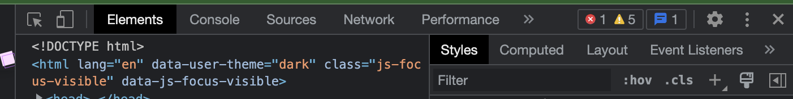

- Parent의 속성이 Child에게 전달되는 특징
- 상속되는 속성과 상속되지 않는 속성이 있음.
  - 직관적
  - 자주 사용하는 속성 중 상속되는 속성
    - color
    - font
    - line-height
    - letter-spacing
    - text-align
    - word-spacing
    - visibility
    - https://web.dev/learn/css/inheritance/#which-properties-are-inheritable
    - https://www.w3.org/TR/CSS21/propidx.html
- 상속 제어하기
  - inherit
    - Parent 속성 값을 상속하겠음
  - initial
    - Default 속성 값을 사용하겠음
  - unset
    - 부모 속성이 있으면 부모 속성, 없으면 브라우저 디폴트를 사용하겠다.
- 크롬 개발자툴 이용해서 확인 수정 가능
  - 